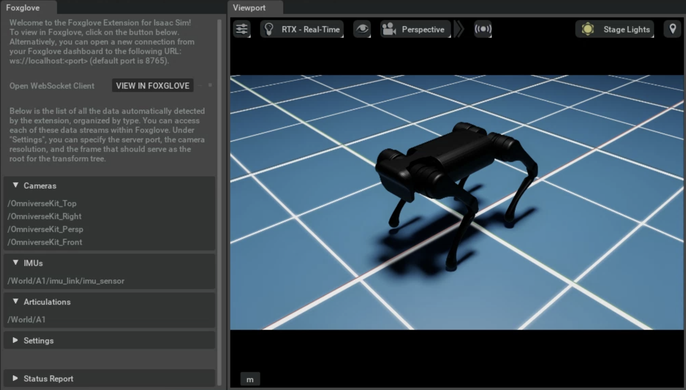

# *Foxglove Extension* for Isaac Sim

An Isaac Sim extension to connect any project to the Foxglove visualization platform.

## Using the Extension

Once the extension is installed, enable it and open the extension tab under `Foxglove` > `Foxglove Extension` in the toolbar. A Foxglove server will be started automatically and remain open until this tab is closed.

 

To visualize the data, simply click on "View in Foxglove" to directly connect to the WebSocket session.

Alternatively, from your [Foxglove Dashboard](https://app.foxglove.dev/), open a new WebSocket connection to URL: `ws://localhost:<port>`, where `<port>` can be specified in the *Settings* menu of the extension tab (default is `8765`).

 

You can now [customize your layout](https://docs.foxglove.dev/docs/visualization/layouts/) as you please and visualize away!

